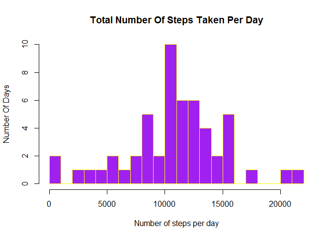
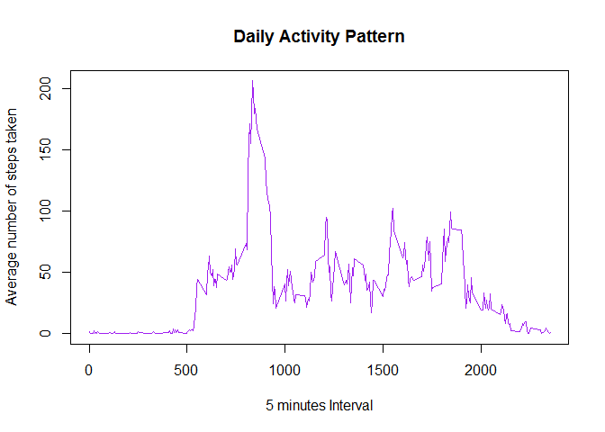
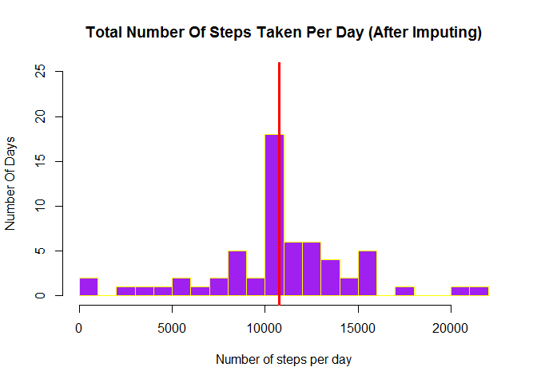
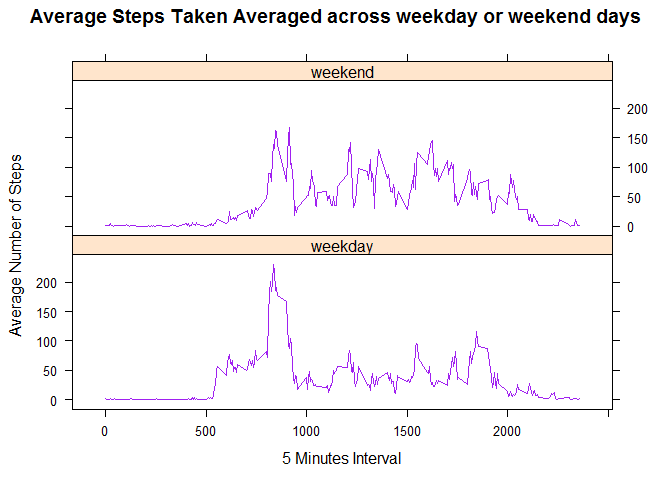

# Reproducible Research: Peer Assessment 1


## Loading and preprocessing the data

The data are available in the repository in the zip file format. We have to unzip the file and read the data from csv file. Below code makes sure the zip file is downloaded from the server if it is missing in the repository and reads the data from the unzipped file.  


```r
#Read the data
filename<-"activity.csv"
zipfilename<-"activity.zip"
if(!file.exists(filename)){
    if(!file.exists(zipfilename)){
        source<-"https://d396qusza40orc.cloudfront.net/repdata%2Fdata%2Factivity.zip"
        download.file(source,destfile=zipfilename)
    }
    unzip(zipfile = zipfilename)
}

activity<-read.csv("activity.csv", header = TRUE, stringsAsFactors = FALSE, 
                   colClasses = c("numeric","character","integer"))
```
  
The type of 'date' column in the above dataset is character. We should change it to 'Date' format.

```r
#Change the type of the column 'date'
activity$date<-as.Date(activity$date)
```

## What is mean total number of steps taken per day?

In order to find the mean total number of steps taken per day, first we need to make sure there are no missing values in the 'steps' column of the dataset.

```r
sum(is.na(activity$steps))
```

```
## [1] 2304
```
 
Since there are missing values, we need to create a new dataset and copy the proper values from 'activity' dataset. Then find the mean total number of steps taken per day using tapply. 

```r
rm_na_activity<-activity[which(!is.na(activity$steps)),]
stepsperday<-tapply(rm_na_activity$steps, rm_na_activity$date, sum)
```
  
Let us display the data in a histogram. 

```r
hist(stepsperday,20,col="purple",xlab="Number of steps per day", 
     ylab="Number Of Days",border="yellow", main="Total Number Of Steps Taken Per Day")
```

<!-- -->
  
The meadian total number of steps taken per day can be determined using below code.

```r
med<-median(stepsperday)
med
```

```
## [1] 10765
```
    
The median total number of steps taken per day is 1.0765\times 10^{4}  
  
The mean total number of steps taken per day can be determined using below code.

```r
avg<-mean(stepsperday)
avg
```

```
## [1] 10766.19
```

So the mean total number of steps taken per day is 1.0766189\times 10^{4}
  
## What is the average daily activity pattern?
  
The average daily activity pattern can be determined by using the tapply function as given below.

```r
dailyactivity<-tapply(rm_na_activity$steps, rm_na_activity$interval, mean)
```
  
Below time series plot displays the 5-minute interval (x-axis) and the average number of steps taken, averaged across all days (y-axis)

```r
plot(x = names(dailyactivity), y = dailyactivity, type = "l",  
     xlab = "5 minutes Interval",  ylab = "Average number of steps taken", 
     col="purple",main = "Daily Activity Pattern")
```

<!-- -->
  
Below code finds and displays the 5-minute interval that contains the maximum steps, on average across all the days in the dataset

```r
dailyactivity[dailyactivity==max(dailyactivity)]
```

```
##      835 
## 206.1698
```


## Imputing missing values
  
The total number of missing values in the dataset is given below.

```r
sum(is.na(activity))
```

```
## [1] 2304
```
    

We create a new dataset 'activity_imputed' that is equal to the original dataset. Then we can fill in the missing values with the  mean of the 5 - minutes interval.

```r
activity_imputed<-activity
daily_values<-dailyactivity[as.character(activity_imputed[which(is.na(activity_imputed$steps)),3])]
activity_imputed[which(is.na(activity_imputed$steps)),1]<-daily_values
sum(is.na(activity_imputed))
```

```
## [1] 0
```

```r
stepsperday_imputed<-tapply(activity_imputed$steps, activity_imputed$date, sum)
```
  
Let us plot a histogram of the total number of steps taken each day. Draw a line to highlight the median of the dataset.  

```r
hist(stepsperday_imputed,20,col="purple",xlab="Number of steps per day", 
     ylab="Number Of Days",border="yellow", ylim=c(0,25), 
     main="Total Number Of Steps Taken Per Day (After Imputing)")
abline(v = median(stepsperday_imputed), col = "red", lwd = 3)
```

<!-- -->
  
The mean and median of the new dataset are given below.

```r
#mean
mean(stepsperday_imputed)
```

```
## [1] 10766.19
```

```r
#median
median(stepsperday_imputed)
```

```
## [1] 10766.19
```
  
We can check how these values differ from the estimates from the first part of the assignment by taking the difference of the 2 values.

```r
mean(stepsperday)-mean(stepsperday_imputed)
```

```
## [1] 0
```

```r
median(stepsperday)-median(stepsperday_imputed)
```

```
## [1] -1.188679
```
  
The above code shows imputing has no impact on the mean, but has minimal impact on the median.

## Are there differences in activity patterns between weekdays and weekends?
    
Let us create a new factor variable in the dataset with two levels - "weekday" and "weekend" indicating whether a given date is a weekday or weekend day.

```r
library("lattice")
condition<-(weekdays(activity_imputed$date) %in% c('Sunday','Saturday'))
activity_imputed$typeofday<-factor(condition, 
                                   levels=c(FALSE, TRUE),labels=c('weekday', 'weekend'))

average_steps<-aggregate(activity_imputed$steps, 
                         by=list(activity_imputed$typeofday,activity_imputed$interval), 
                         FUN=mean)
colnames(average_steps)<-c("daytype","interval","steps")
```
  
Let us make a panel plot containing a time series plot (i.e. type = "l") of the 5-minute interval (x-axis) and the average number of steps taken, averaged across all weekday days or weekend days (y-axis). 

```r
with(average_steps, xyplot(steps ~ interval | daytype, type = "l",layout = c(1,2), col="purple",
                            main = "Average Steps Taken Averaged across weekday or weekend days",
                            xlab = "5 Minutes Interval", ylab = "Average Number of Steps"))
```

<!-- -->
  
The plot clearly shows the distribution throughout the day on weekdays and weekends are different. It shows, in the morning inidividuals took more steps during weekdays than on weekends. 
